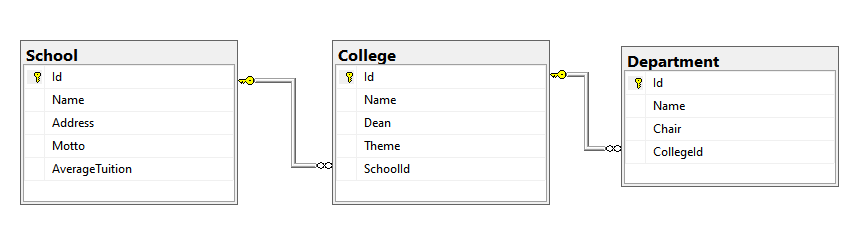

# CSIT327 3.2 School DB Multimapping 🏫🤯

## Task
1. Run `SchoolDb.sql` to your local database. 
It will create an `Exer3Db` database with a `School`, `College`, and `Department` Table.



2. Add/create necessary models and properties for `School`, `College`, and `Department` models.
3. Implement `ISchoolRepository` _**ASYNCHRONOUSLY**_.
	 - `Get(id)` - Returns single school with Id == id
	 - `GetAll()` - Returns all schools
	 - These methods should only use ONE sql statement and Query each call. **NO MULTIPLE QUERY CALLS**.
	 - Should utilize Dapper multimapping capabilities.

4. `Program.cs` `Main` method already configured for testing and submission. Do not modify.

## Model format when printed in console
		
```json
[
    {
        "Id": 1,
        "Name" : "SchoolName1",
        "Address" : "SchoolAddress1",
        "Motto" : "SchoolMotto1",
        "AverageTuition" : 1,
        "Colleges" : [
            {
                "Id": 1,
                "Name" : "CollegeName1",
                "Dean" : "CollegeDean1",
                "Theme" : "CollegeTheme1",
                "Departments" : [
                    {
                        "Id": 1,
                        "Name" : "DepartmentName1",
                        "Chair" : "DepartmentChair1"
                    },
                    {
                        "Id": 2,
                        "Name" : "DepartmentName2",
                        "Chair" : "DepartmentChair2"
                    }
                    // ... more departments under this college1
                ]
            }
            // ... more colleges under this school1
        ]
    }
    // ... more schools
]
```

----
## Resources
How to get connection string: \
https://www.c-sharpcorner.com/UploadFile/d40a40/get-sql-server-database-connection-string-easily-from-visual

Learn dapper :\
https://www.learndapper.com/

C# Data Linq Transformation : \
https://csharp.net-tutorials.com/linq/grouping-data-the-groupby-method/
https://csharp.net-tutorials.com/linq/data-transformations-the-select-method/
https://www.codingame.com/playgrounds/213/using-c-linq---a-practical-overview/selectmany

# Project Repository DO's and DONT's

## DO's ✅
1. Observe DRY. 
2. Make atomic commits. 
3. Apply good commit messages 
4. Document code. 
5. Remove code smells.
6. Remember to push final codes in master.

## DONT'S ❌
Failure to comply on the following will **automatically void your grade** in this exercise: 

1. Do NOT change function signature. 
2. Do NOT touch anything in `.github` folder. 
3. Do NOT edit README.md 
4. Do NOT modify tests in `*.Tests` project.


---
### Prepared by:
Yours Truly,

**Jhon Christian Ambrad** \
jhonchristian.ambrad@cit.edu \
+639761014328
